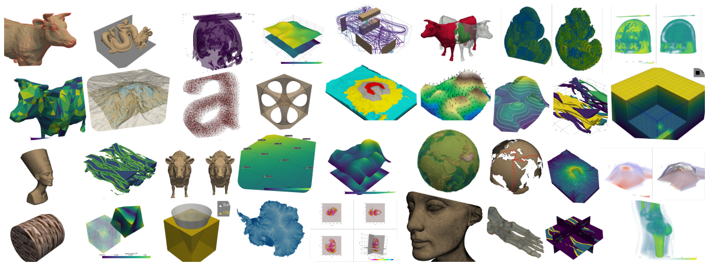

### PyVista: 3D visualization and mesh analysis for science and engineering

PyVista is the foundational Python library for 3D visualization and mesh analysis, the same role pandas plays for tabular data and xarray plays for labeled n-dimensional arrays. It is image-regression tested on every commit across the supported matrix of Python and VTK releases, so code written against PyVista keeps working as the rendering stack evolves.

PyVista is used across science and engineering to visualize 3D data and models, generate publication-quality figures, automate analysis workflows, and build custom applications on top of PyVista's 3D capabilities. The API is approachable enough for novice programmers and streamlined enough that graphics experts reach for it to skip the boilerplate.

#### Built in the open

PyVista is developed by a community of contributors from computational geophysics, aeronautical engineering, neuroscience, software engineering, and beyond. New to programming? **Welcome.** Many PyVista users are novice programmers, and the API is designed to be ready for beginners.

#### Built to extend

Downstream libraries plug into PyVista through a small, lazily evaluated extension API: registered accessors and plotter components, no subclassing or monkey-patching. See [awesome-pyvista](https://github.com/pyvista/awesome-pyvista) for domain-specific tooling already built on top.

### Professional Support

*Need help getting the most out of PyVista? Want to sponsor development of new capabilities?*

Reach out to support@pyvista.org and we can connect you with community experts to help you use PyVista or tailor custom software around its 3D capabilities.
