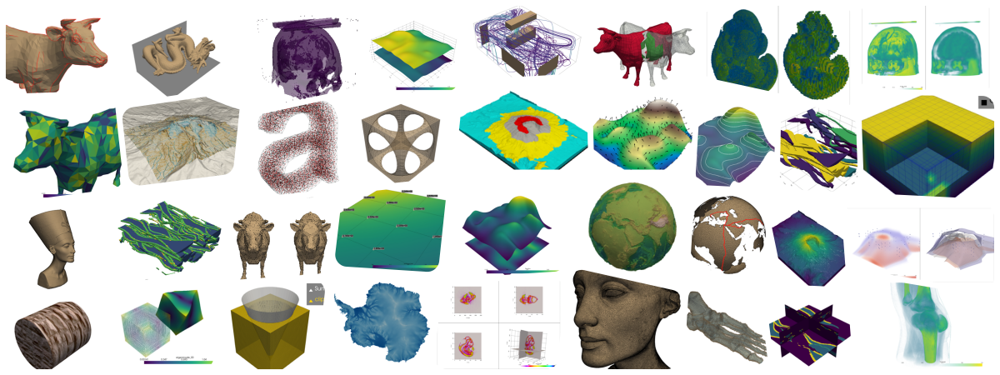

### PyVista: a community effort to make 3D visualization and analysis more approachable

> *Our goal is to make 3D visualization and analysis approachable to domain-scientists so they can focus on the research questions at hand.*

PyVista is used across science and engineering disciplines. A diverse community use PyVista to visualize data/models in 3D, generate publication-quality illustrations, automate analysis workflows, and build custom applications leveraging PyVista's 3D capabilities.

Join our an open source community - our developers come from a wide breadth of backgrounds ranging from computational geophysics to aeronautical engineering. Our diverse team of developers is what makes PyVista successful and able to be used across disciplines.

*New to programming?* **Welcome!** Many of PyVista's users are novice programmers and we've designed PyVista to be intuitive and ready for beginners to get started making compelling visualizations of complex geometries.

### Professional Support

*Need help getting the most out of PyVista? Want to sponsor development of new capabilities?*

Please reach out to support@pyvista.org and we can connect you with the right community experts, who can help you confidently and efficiently use PyVista and/or tailor your custom software to leverage PyVista's robust 3D visualization capabilities.
